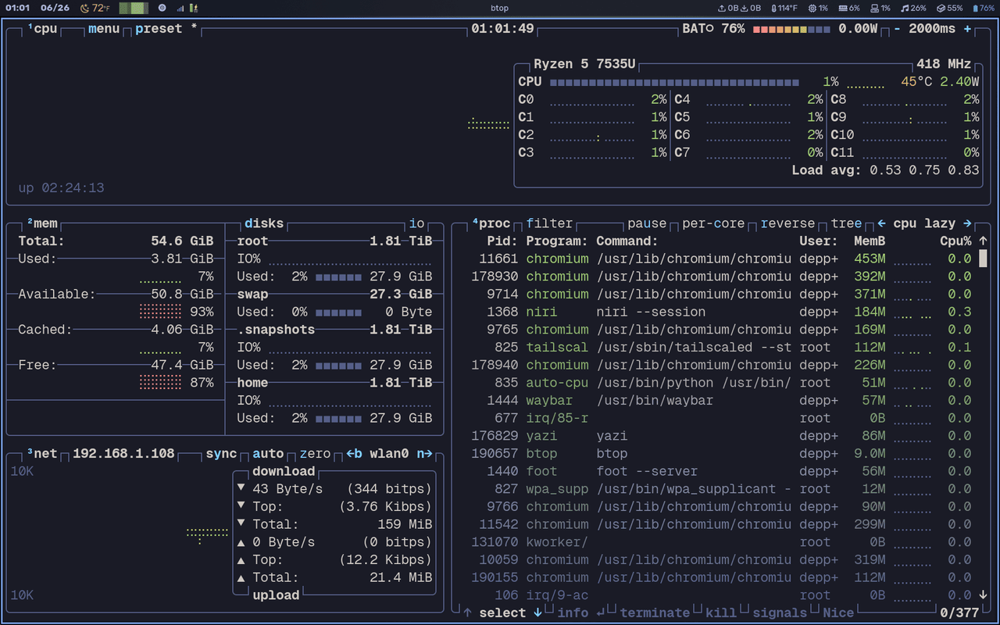
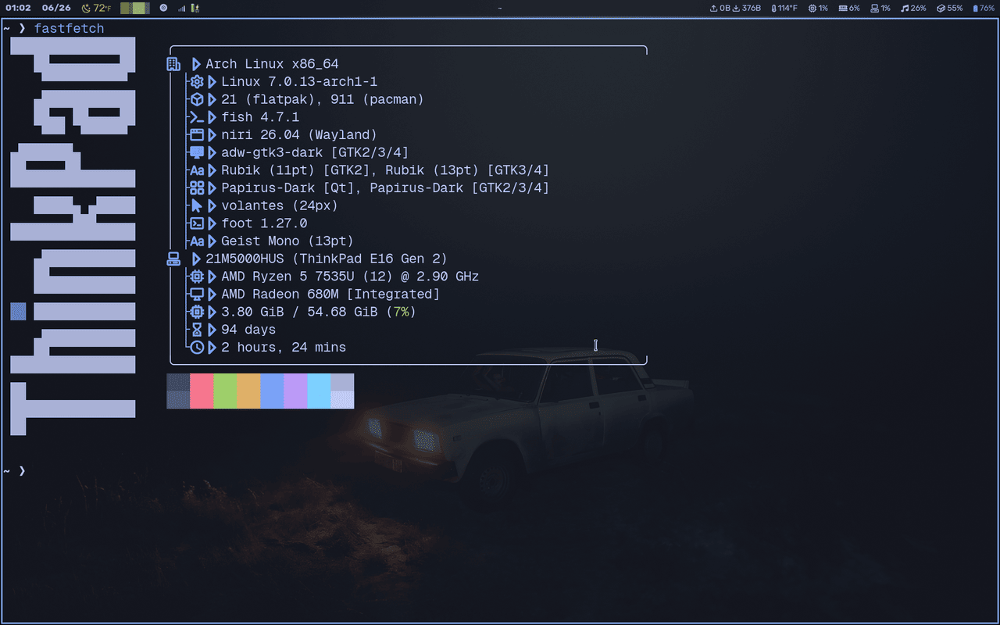
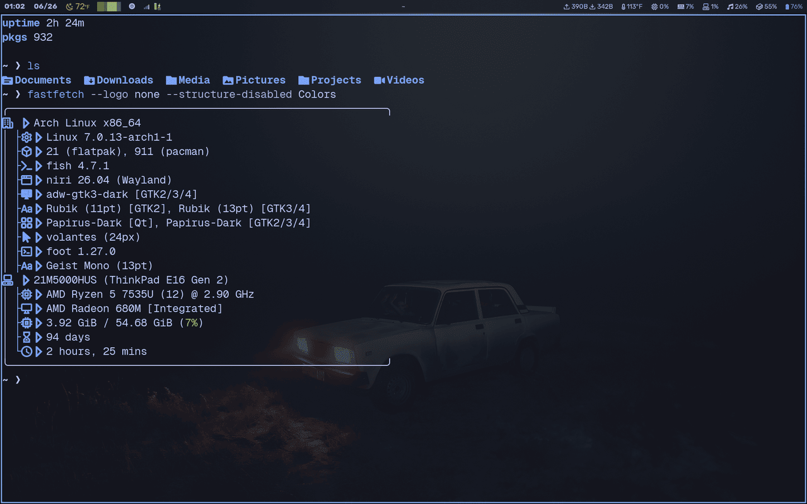
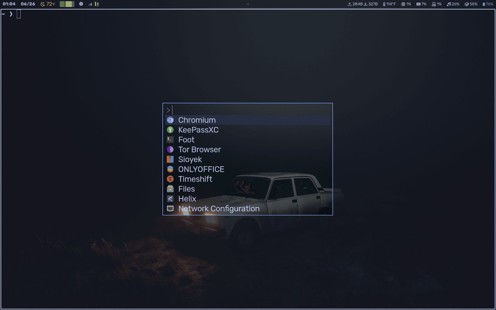
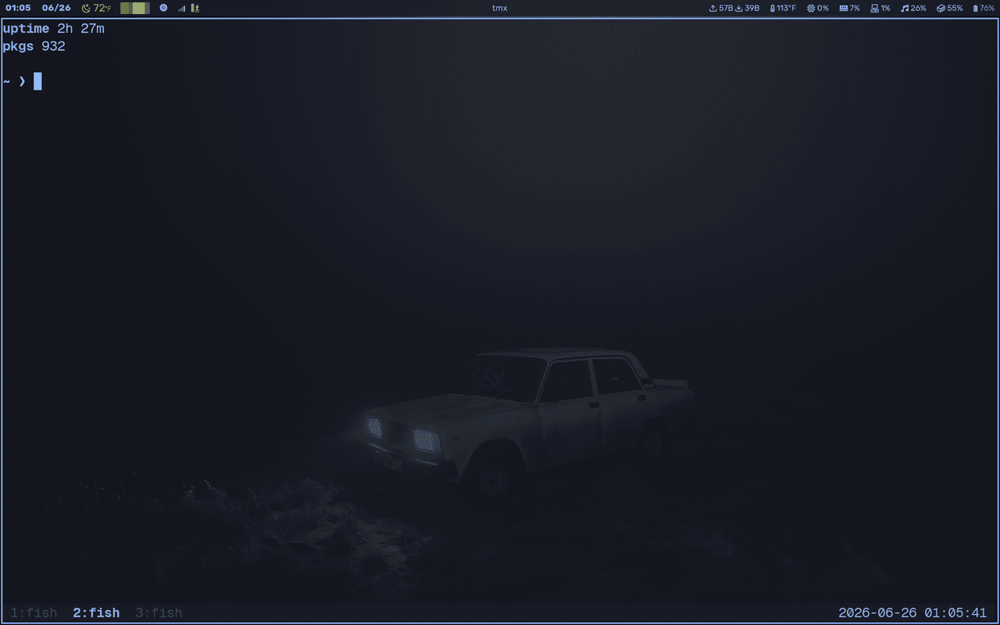
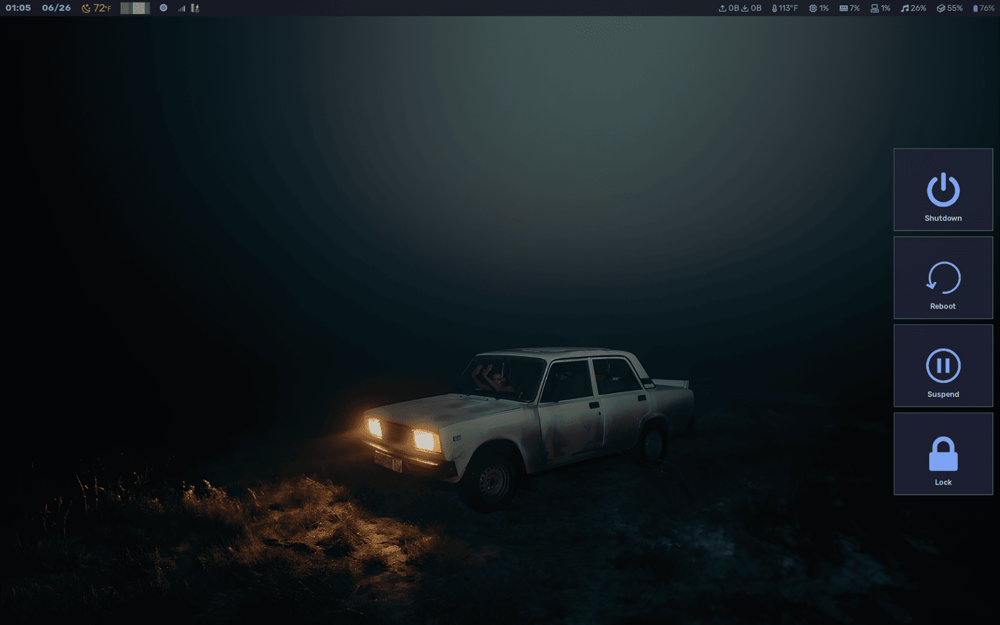
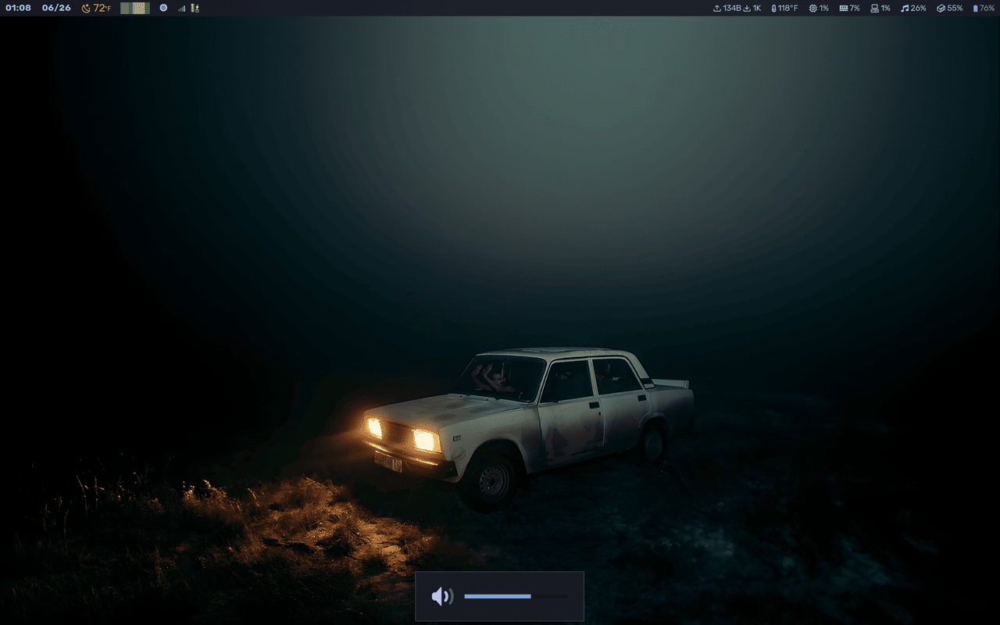
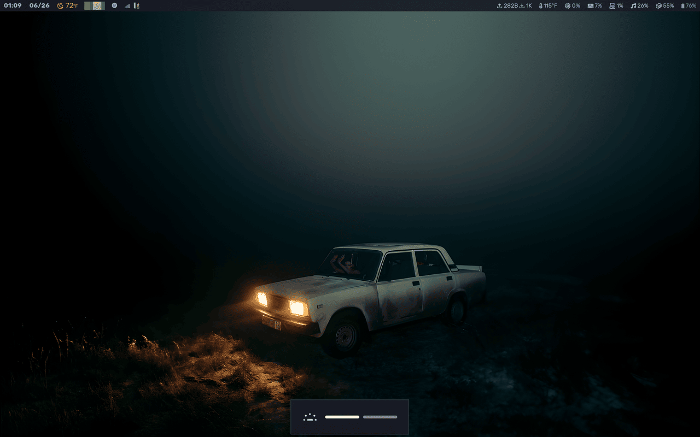

# -Dots

Personal dotfiles for [niri](https://github.com/YaLTeR/niri) on Arch Linux — Wayland, fish shell, Tokyo Night theme throughout.

## 🧩 Components

| Application | Config Path | Description |
| --- | --- | --- |
| [btop](https://github.com/aristocratos/btop) | `btop/` | Resource monitor |
| [fastfetch](https://github.com/fastfetch-cli/fastfetch) | `fastfetch/` | System info on shell startup |
| [foot](https://codeberg.org/dnkl/foot) | `foot/` | Wayland-native terminal emulator |
| [fuzzel](https://codeberg.org/dnkl/fuzzel) | `fuzzel/` | Application launcher |
| [tmux](https://github.com/tmux/tmux) | `tmux/` | Terminal multiplexer |
| [wlogout](https://github.com/ArtsyMacaw/wlogout) | `wlogout/` | Logout / power menu |
| [swayosd](https://github.com/ErikReider/SwayOSD) | `swayosd/` | On-screen volume/brightness overlay |
| [swaylock](https://github.com/swaywm/swaylock) | `swaylock/` | Screen locker |

## 📸 Screenshots

| btop | fastfetch | foot |
| --- | --- | --- |
|  |  |  |

| fuzzel | tmux | wlogout |
| --- | --- | --- |
|  |  |  |

| swayosd — volume | swayosd — brightness | swayosd — backlight |
| --- | --- | --- |
|  |  |  |

*(swaylock has no screenshot — it's a lock screen, so there's not much to show.)*

## How this is structured (reverse stow)

The usual dotfiles-with-stow setup keeps the real config files inside the repo and symlinks them out into `~/.config`. This repo does the opposite: **the real files stay exactly where Linux expects them, in `~/.config/<app>/`, and this repo holds symlinks pointing back at them.**

```
~/.config/btop/btop.conf     ← the REAL file lives here, untouched
~/Projects/-Dots/btop/...    ← this repo holds a SYMLINK pointing back at it
```

Why: `~/.config` stays the single source of truth that every app reads/writes normally, with zero risk of an app's atomic-save behavior breaking a forward symlink. This repo is just a versioned, syncable index of which configs are tracked.

Editing a config (`helix ~/.config/btop/btop.conf`, etc.) is reflected everywhere instantly — there's nothing to sync, since there's only ever one real file. Git only needs to know about it when a config's *file set* changes (a file added or removed inside its folder), not when existing file contents change.

## Managing this repo: the `dots` command

This repo isn't stowed by hand — a fish function called `dots` wraps GNU Stow plus git, so adding, removing, or re-linking a config and syncing it to both remotes is one command.

```fish
dots add <package>              # stow a package (mkdir + stow -S)
dots remove <package>           # unstow a package (stow -D)
dots restow <package>           # re-link a package after restructuring (stow -R)
dots push [package]             # commit + push pending changes, no stow action

# add --push to any of the above to commit + push to both remotes in the same step
dots add btop --push
dots restow foot --push --msg "custom commit message"
```

Safety behavior, by design:
- `git add` is always scoped to just the package being touched — other unrelated dirty files in the repo are never swept in.
- If there's nothing to commit for that package, it says so and exits — no empty commits.
- Pushes are **never forced**. If a remote is ahead (e.g. pushed from the other machine first), it stops cleanly and tells you to pull — it does not overwrite history.
- If `screenshots/<package>*.png` exists, it's automatically included in the same commit when that package is added, removed, or restowed — so adding a new screenshot for an existing config just needs `dots restow <package> --push`.

Tab completion for package names and flags is included (`~/.config/fish/completions/dots.fish`).

## Remotes

Pushed to both:
- **GitHub** — `github.com/deppess/-Dots`
- **Codeberg** — `codeberg.org/deppes/-Dots`

## Setup on a new machine

```fish
git clone git@github.com:deppess/-Dots.git ~/Projects/-Dots
cd ~/Projects/-Dots
git remote add codeberg git@codeberg.org:deppes/-Dots.git

# install the dots function + completions
cp dots.fish ~/.config/fish/functions/dots.fish
cp dots-completions.fish ~/.config/fish/completions/dots.fish

# re-link each package against this machine's ~/.config
dots restow btop
dots restow fastfetch
dots restow foot
dots restow fuzzel
dots restow tmux
dots restow wlogout
dots restow swayosd
dots restow swaylock
```
